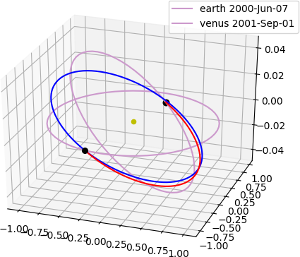

Low-thrust global optimization (Nuclear electric propulsion)
============================================================

This plot is produced by the following code:

.. code-block:: python

   from pykep import *
   examples.run_example1(nseg=40)

after the monotonic basin hopping algorithm concludes its computations. Different images are actually produced each time as
the algorithm is non-deterministic.

This example demonstrates the use of the Sims-Flanagan module of pykep to perform global optimization of a single leg interplanetary
trajectory over large launch windows. In particular, it defines a
transfer between the Earth and Mars as an NLP global optimization problem (using the open source `PyGMO project <http://pagmo.sourceforge.net/pygmo/index.html>`_)
and it then attempts to find one solution using the Monotonic Basin Hopping meta-algorithm connected to an SQP local optimization technique (from SciPy). In case
the user has a license for SNOPT, the use of this typically result in a performance gain

The code for this example can be studied `here. 
<https://github.com/esa/pykep/blob/master/pykep/examples/_ex1.py>`_ Feel free to leave comments.

A reference where the methodology is studied more in depth is:

C H Yam, D D Lorenzo, D Izzo: `Low-thrust trajectory design as a constrained global optimization problem <http://pig.sagepub.com/content/early/2011/08/09/0954410011401686.abstract>`_  doi: 10.1177/0954410011401686
Proceedings of the Institution of Mechanical Engineers, Part G: Journal of Aerospace Engineering August 10, 2011

