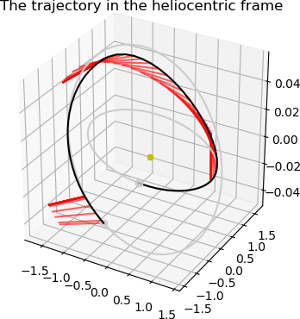

Using homotopy and Pontryagin to refine solutions from the direct method - Part II
==================================================================================

.. figure:: ../images/gallery10b.png
   :align: left
   

These plots are produced by the following code:

.. code-block:: python

   import pykep as pk
   pk.examples.run_example10()

if snopt7 is not available, ipopt or slsqp will also produce, eventually, a feasible solution. 

This example demonstrates the use of the :class:`pykep.trajopt.indirect_pt2pt` which represents, in cartesian
coordinates, the TPBVP problem resulting from applying Pontryagin maximum principle to the dynamics of a mass
varying spacecraft. The starting and final conditions are fixed (as well as the time of flight) and were obtained running a direct method first (see previous example). The end
condition is a Mars randezvous. 

The code for this example can be studied `here. 
<https://github.com/esa/pykep/blob/master/pykep/examples/_ex10.py>`_ Feel free to leave comments.
