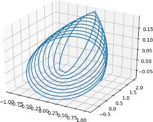
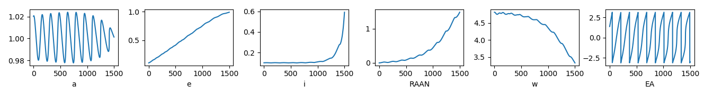
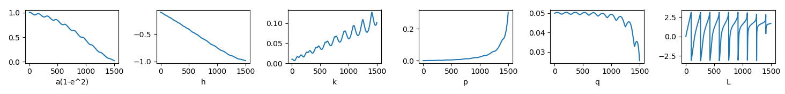

Orbital parameters (osculating and modified equinoctial)
===================================================================================

In this example we show some simple and basic astrodynamics routines that help visualizing trajectories using
their osculating Keplerian parameters or their modified equinoctial elements.

Let us first generate some trajectory using a two-body propagator that uses an inertially fixed thrust.
This is just used as an example to obtain some coordinates to use. Also, note we make use of non dimensional
units so that the gravitational parameter is set to be 1.

.. code-block:: python

    >>> import pykep as pk
    >>> from math import pi
    >>> r = [1, 0, 0]
    >>> v = [0.1, 1, 0.1]
    >>> m = 100
    >>> x = [1]; y = [0]; z=[0]
    >>> dx = [0.1]; dy = [1]; dz=[0.1]
    >>> for i in range(1500):
    ...     r,v,m = pk.propagate_taylor(r,v,m,[1,0.1,0.1],pi/80,1,1,-15,-15)
    ...     x.append(r[0]); y.append(r[1]); z.append(r[2])
    ...     dx.append(v[0]); dy.append(v[1]); dz.append(v[2])

We may now plot the trajectory using matplotlib, obtaining the first figure on the left:

.. code-block:: python

    >>> from matplotlib import pyplot as plt
    >>> fig = plt.figure()
    >>> axis = fig.gca(projection='3d')
    >>> plt.plot(x,y,z)

We now want to visualize the change in the Keplerian osculating parameter along this trajectory. To do this
we transform the cartesian representation of the whole trajectory into orbital parameters as follows:

.. code-block:: python

    >>> E = []
    >>> for i in range(1500):
    ...     tmp = pk.ic2par(r = [x[i], y[i], z[i]], v = [dx[i], dy[i], dz[i]], mu = 1.0)
    ...     E.append(tmp)
    >>> labels = ['a', 'e', 'i', 'RAAN', 'w', 'EA']
    >>> for i in range(6):
    ...     plt.subplot(1,6,i+1)
    ...     plt.plot([el[i] for el in E])
    ...     plt.xlabel(labels[i])

In some cases the Keplerian osculating parameters are not defined and the above computations would produce
nans and infs (for example for zero eccentricity or inclination). The set of modified equinoctial elements,
insted is always defined and guaranteed to produce real values in all cases. 

    >>> EQ = []
    >>> for i in range(1500):
    ...     tmp = pk.ic2eq(r = [x[i], y[i], z[i]], v = [dx[i], dy[i], dz[i]], mu = 1.0)
    ...     EQ.append(tmp)
    >>> labels = ['a(1-e^2)', 'h', 'k', 'p', 'q', 'L']
    >>> for i in range(6):
    ...     plt.subplot(1,6,i+1)
    ...     plt.plot([el[i] for el in EQ])
    ...     plt.xlabel(labels[i])

