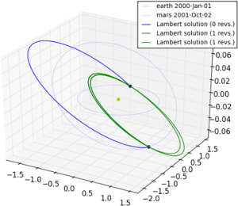

Multi revolutions Lambert Problem
=================================

This plot is produced by the following code:

.. code-block:: python

   import pykep as pk
   pk.examples.run_example2()

The example demonstrates the basic use of the multiple revolution Lambert solver. In particualar, it defines a fixed geometry of the
Earth-Mars constellation and plots all possible resulting solution to the Lambert's problem. The chosen geometry is such that one revolution solutions
exists and are thus visualized.

While not published yet, the multi-rev solver implemented in pykep is extremely efficient, if anyone knows about a faster implementation of
a Lambert's solver, please contact us. In our solver we use a transformation that deforms the time of flight curves into lines, thus allowing uniform
consistent convergence properties for all possible geometries.

The code for this example can be studied `here. 
<https://github.com/esa/pykep/blob/master/pykep/examples/_ex2.py>`_ Feel free to leave comments.
