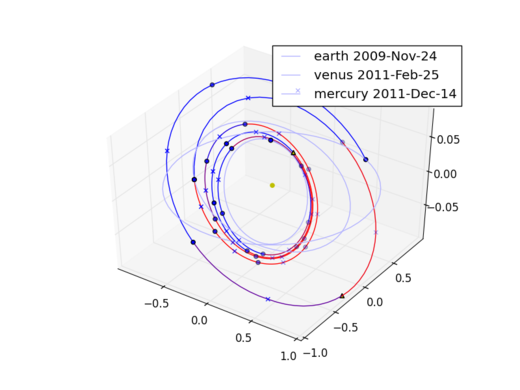

LT-MGA global optimization (Nuclear electric propulsion)
========================================================

This plot is produced by the following code:

.. code-block:: python

   from PyKEP import *
   kep_examples.run_example3()

after the monotonic basin hopping algorithm concludes its computations. Different images are actually produced each time as
the algorithm is non-deterministic.

The example demonstrates the use of the sims-flanagan module of PyKEP to perform global optimization of a multiple leg interplanetary trajectory over
large launch windows. In particular, it defines a
transfer between Earth and Mercury making use of a Venus intermediate fy-by as an NLP global optimization problem (using the open source `PyGMO project <http://pagmo.sourceforge.net/pygmo/index.html>`_)
and it then attempts to find one solution using the Monotonic Basin Hopping meta-algorithm connected to an SQP local optimization technique (from SciPy). In case
the user has a license for SNOPT, the use of this typically result in a performance gain

The code for this example can be studied `here 
<http://sourceforge.net/p/keptoolbox/code/ci/ef0454a6a69403a1786a4e7920c3fe036a916ad2/tree/PyKEP/examples/_ex3.py>`_
