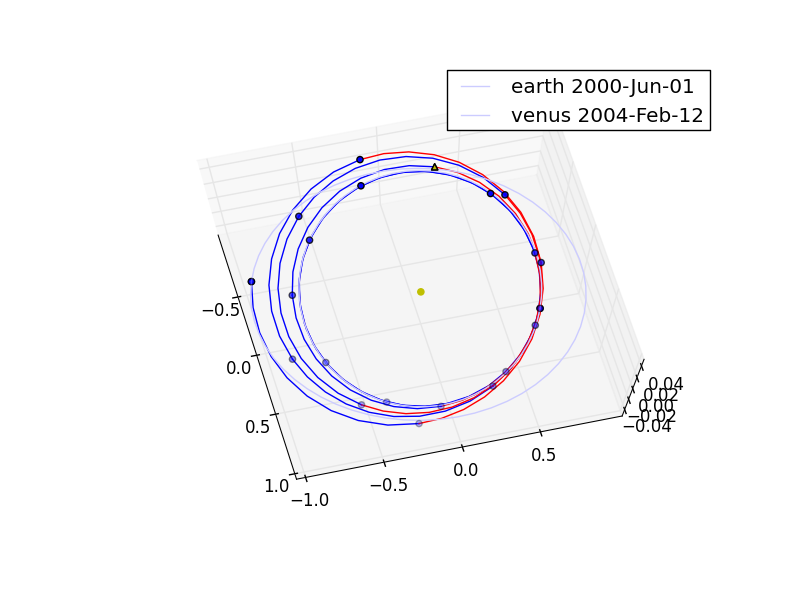

Automated Mesh Adaptation in low-thrust Interplanetary Trajectory Optimization
==============================================================================

This plot is produced by the following code:

.. code-block:: python

   import pykep as pk
   pk.examples.run_example4(nseg=20)
   
In this case, an interplanetary trajectory is computed using a new type of leg using Sundmann's variable rather than time and thus obtaining
automated mesh adaptation. By letting time flow slower when near the sun, we obtain segments of different length depending on their distance from the Sun.
This translate into a more efficient segment distribution, both from the Taylor integration perspective and for the thrust numerical grid perspective. In case the user has a license for SNOPT, the use of this typically results in a performance gain

The code for this example can be studied `here. 
<https://github.com/esa/pykep/blob/master/pykep/examples/_ex4.py>`_ Feel free to leave comments.

A preliminary study of this unique technique, can be found in the paper below.

C H Yam, D Izzo and Biscani F: `Towards a High Fidelity Direct Transcription Method for Optimisation of Low-Thrust Trajectories <http://www.esa.int/gsp/ACT/doc/MAD/pub/ACT-RPR-MAD-2010-(AstroTools)Sundmann.pdf>`_ International Conference on Astrodynamics Tools and Techniques - ICATT,	 2010.

