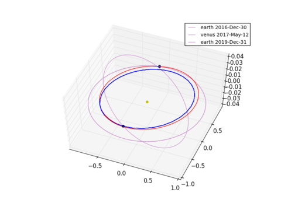

Global optimization of a multiple gravity assist trajectory with one deep space maneuver per leg
================================================================================================

.. figure:: ../images/gallery5.png
   :align: left
   

These plots are produced by the following code:

.. code-block:: python

   import pykep as pk
   pk.examples.run_example5()

after the self-adaptive differential evolution algorithm concludes its computations. 

The example demonstrates the use of the mga_1dsm problem constructor of the *interplanetary* module. 
This helper class allows to construct a pygmo global optimization problem (`pygmo project <http://pagmo.sourceforge.net/pygmo/index.html>`_) 
representing a Multiple Gravity Assist Interplanetary Trajectory where only one Deep Space Maneuver is allowed in each leg. The problem is constructed as either a single objective (total DV) or
even a multiobjective optimization problem (DV and time of flight). The alpha encoding is used for the time of flights allowing to specify only the mission duration and leaving the optimizer 
the task to allocate such a budget among the different legs. The alternative, called tof encoding, would be to specify the time of flight for each single leg. This would result in an easier problem
for the optimizer, but it does require added domain knowledge. 

In the particular instance constructed in the example, we have an Earth-Venus-Earth transfer with a Venus intermediate
fly-by. The selected launch windows is 2016-2017, the launch hyperbolic velocity is 2.5 km/s and the allowed time of flight is in [0.5,3] years.

To solve such a global optimization problem, we use jDE, a self-adaptive version of differential evolution and the generalized migration
operator, thus computing the solution in eight paralel threads.

The code for this example can be studied `here. 
<https://github.com/esa/pykep/blob/master/pykep/examples/_ex5.py>`_ Feel free to leave comments.
