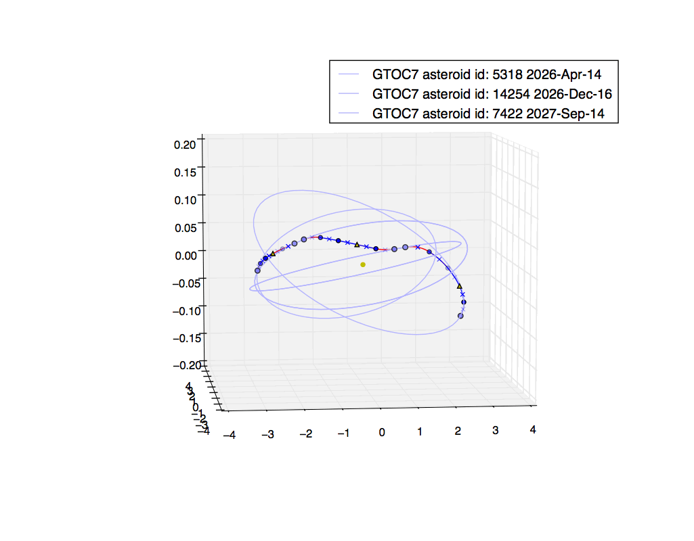

Asteroid hopping in the main belt with a low-thrust spacecraft
==============================================================

   

THis plot is produced by the following code:

.. code-block:: python

   import pykep as pk
   pk.examples.run_example6()

if a feasible solution is reached. Repeat several times in case unfeasible solutions are returned.

This example demonstrates the use of the mr_lt_nep class in the trajopt module to design a hopping mission
between main belt asteroids. The class derives from
pygmo problem.base and represents the optimization of a multiple randezvous mission of a low-thrust spacecraft.
The initial guess is taken from one of the trajectory submitted by the ACT/ISAS team to the 7th edition
of the `global trajectory optimisation competition <http://sophia.estec.esa.int/gtoc_portal/>`_. In essence it tries to hop between four different asteroids of the main belt.

The code for this example can be studied `here. 
<https://github.com/esa/pykep/blob/master/pykep/examples/_ex6.py>`_ Feel free to leave comments.
