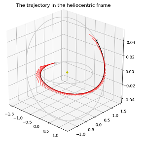
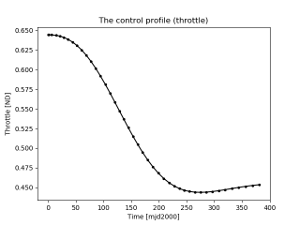

Optimal transfer from Earth to Mars orbits using Pontryagin Maximum Principle (quadratic control)
=================================================================================================

   

These plots are produced by the following code:

.. code-block:: python

   import pykep as pk
   pk.examples.run_example7(solver = "snopt7")

If snopt7 is not available, ipopt or slsqp will also produce (less reliably) a feasible solution. 
Repeat several times in case unfeasible solutions are returned.

This example demonstrates the use of the :class:`pykep.trajopt.indirect_or2or` which represents, in cartesian
coordinates, the TPBVP problem resulting from applying Pontryagin maximum principle to the dynamics of a mass
varying spacecraft. Since the starting and final rendezvous conditions are not enforced, the corresponding
transversality conditions will be activated.

The example solves the quadratic control case, which can be easily be continued by homotopy to the mass optimal solution.

The code for this example can be studied `here. 
<https://github.com/esa/pykep/blob/master/pykep/examples/_ex7.py>`_ Feel free to leave comments.
