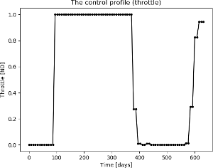

Mass optimal Mars Randezvous using a direct method
==================================================

.. figure:: ../images/gallery8.png
   :align: left

   

These plots are produced by the following code:

.. code-block:: python

   import pykep as pk
   pk.examples.run_example8(nseg = 40)

if snopt7 is not available, slsqp will also produce, eventually, a feasible solution. 
Repeat several times in case unfeasible solutions are returned. Local minima may be found too.
You can also take the solution found and refine it using a direct method using pykep. See the other examples.

This example demonstrates the use of the :class:`pykep.trajopt.direct_pl2pl` which represents, in cartesian
coordinates, the transcribed optimal control problem using a sims-flanagan approach. 

The code for this example can be studied `here. 
<https://github.com/esa/pykep/blob/master/pykep/examples/_ex8.py>`_ Feel free to leave comments.
