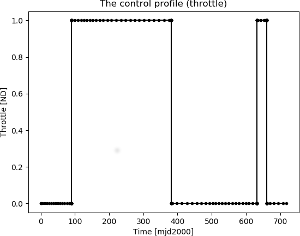

Using homotopy and Pontryagin to refine solutions from the direct method - Part I
=================================================================================

.. figure:: ../images/gallery9.png
   :align: left

   

These plots are produced by the following code:

.. code-block:: python

   import pykep as pk
   pk.examples.run_example9()

if snopt7 is not available, ipopt or slsqp will also produce, eventually, a feasible solution. 

This example demonstrates the use of the :class:`pykep.trajopt.indirect_pt2pl` which represents, in cartesian
coordinates, the TPBVP problem resulting from applying Pontryagin maximum principle to the dynamics of a mass
varying spacecraft. The starting conditions are fixed and were obtained running a direct method first (see previous example). The end
condition is a Mars randezvous. Since the corresponding transversality condition (free time, Mars randezvous) is 
tricky to write for a generic :class:`pykep.planet._base`, we hybridize the indirect method with a direct approach.
We ignore the transversality conditions when computing the Pontryagin leg, but we add as criteria the optimization of the final
mass to be passed directly to the solver. 

Note that the control structure is off bang off bang with a final ballistic arc which is irrelevant since the planet has been 
met a few days before already. 

The code for this example can be studied `here. 
<https://github.com/esa/pykep/blob/master/pykep/examples/_ex9.py>`_ Feel free to leave comments.
